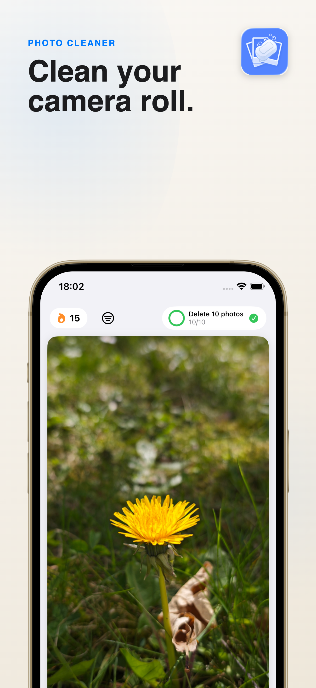
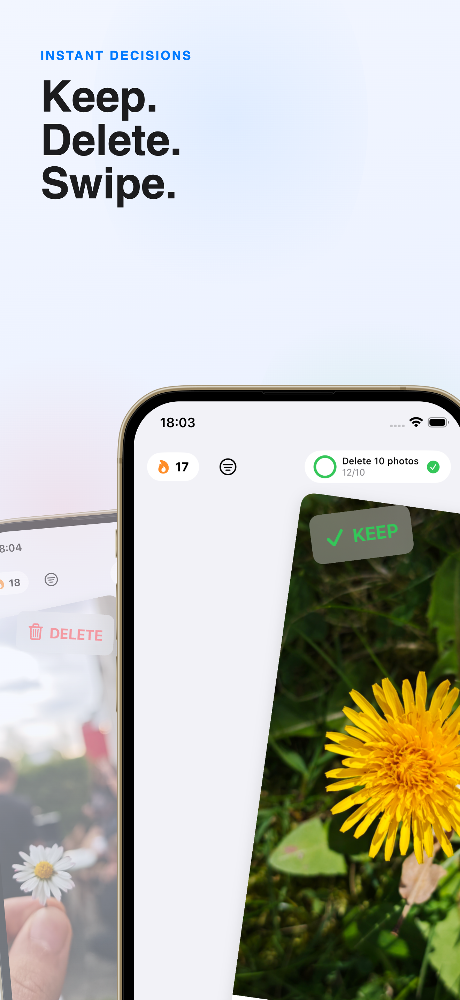
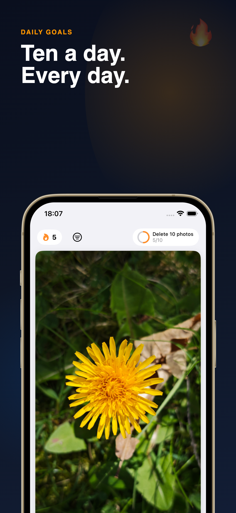

# PhotoSoap

Photo and video cleanup for iPhone with fast swipe reviews, per-media stats, and streak-based progress.

  
  
  

## What It Does

- Review your photo and video library one item at a time.
- Use the media filter to review photos, videos, or both.
- Year and month filters show review progress as a percentage of currently accessible media, respecting media and favorite filters.
- Favorites are hidden by default; include them with the switch in the filter sheet.
- Swipe to keep or queue items for deletion.
- Track overall progress plus photo/video stats with daily goals, streaks, achievements, and storage freed.
- Invite users to contribute optional, privacy-focused community totals during onboarding.

## Release Links

- [Privacy Policy](https://dermoha.github.io/PhotoSoap/privacy.html)
- [Support](https://dermoha.github.io/PhotoSoap/support.html)

## Contributing

If you run into an issue, feel free to open an issue or submit a PR.
