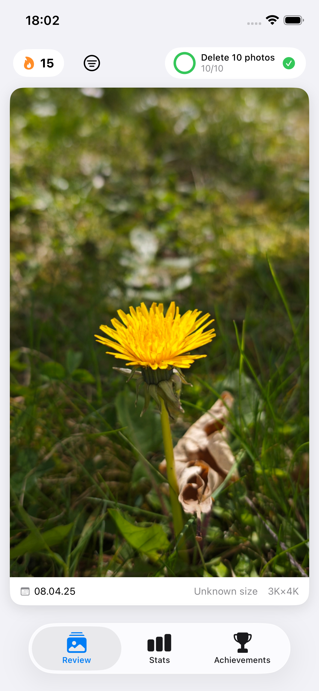
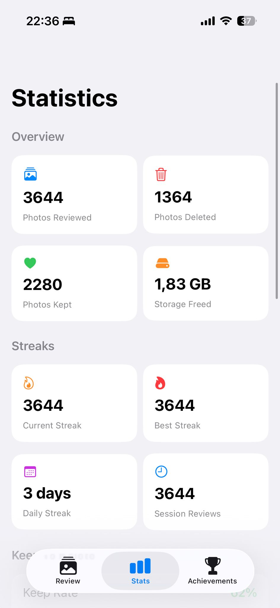
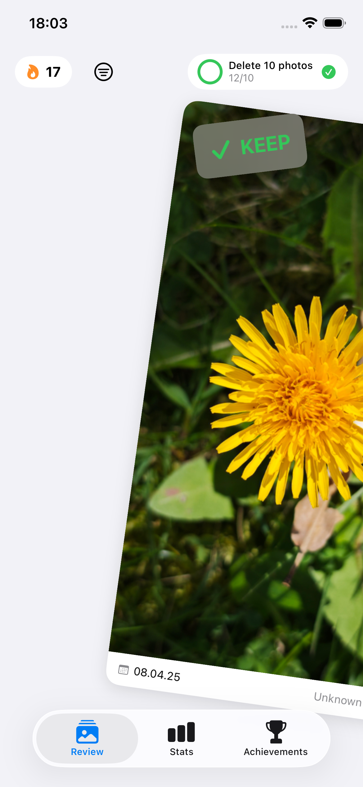
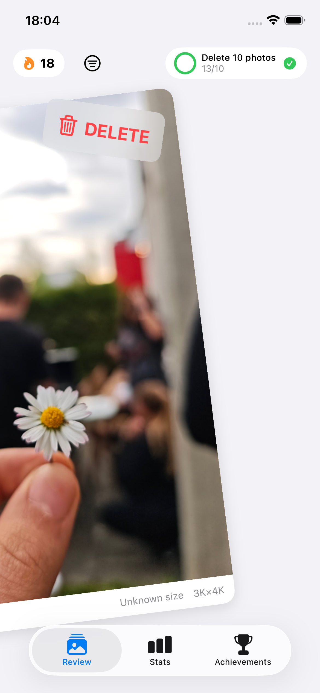

# PhotoSoap

Photo cleanup for iPhone with fast swipe reviews, simple stats, and streak-based progress.

  
  
  

  
  
  

## What It Does

- Review your photo library one image at a time.
- Swipe to keep or queue photos for deletion.
- Track progress with daily goals, streaks, achievements, and storage freed.
- Keep usage analytics optional, off by default, and privacy-focused.

## Release Links

- [Privacy Policy](PRIVACY.md)
- [Support](SUPPORT.md)

## Contributing

If you run into an issue, feel free to open an issue or submit a PR.
